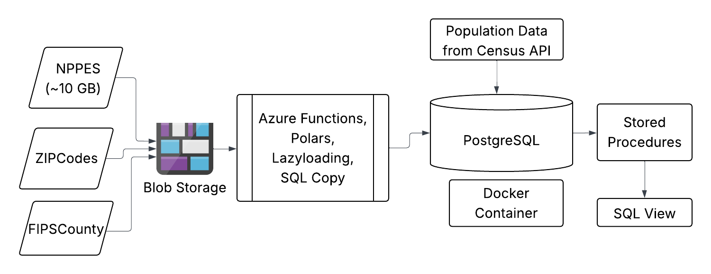

# NPPES Healthcare Provider Analysis Project

A comprehensive data processing pipeline for analyzing healthcare providers across US counties using the National Plan and Provider Enumeration System (NPPES) data.

## 🎯 Project Overview

This project processes and analyzes healthcare provider data to identify the distribution and types of healthcare providers in each US county. The solution includes data extraction, transformation, loading (ETL), and county-level aggregation with population data.

## 🏗️ Architecture



### Data Sources
- **NPPES Data Dissemination File**: Primary healthcare provider data
- **NUCC Taxonomy Codes**: Provider classification and specialization
- **ZIP-County Crosswalk**: Geographic mapping
- **FIPS County Codes**: Standardized county identifiers
- **US Census API**: County population data

## 📊 Database Schema

### Core Tables
- `nppes`: Processed NPPES provider data with standardized fields
- `county_pop`: County information with FIPS codes and population data
- `nucc`: Healthcare provider taxonomy classifications
- `zip`: Contains ZIP codes and their relationships to counties
- `fips`: Contains county names with standardized county codes

### Data Processing Steps

1. **Bulk Load Filtered Data**: The main NPPES dataset (~10 GB) is filtered to retain only necessary columns, then loaded into the database using the SQL `COPY` method. This step leverages Polars' lazy loading from Parquet files for efficient memory usage.

2. **Table Creation via SQL**: New tables are created using `INSERT INTO ... SELECT ...` SQL statements, transforming and organizing the data as needed for downstream analysis.

3. **Table Merges**: Data is merged into related tables to establish relationships and enrich the dataset.

4. **Supplementary Data Loads**: Additional tables (e.g., taxonomy codes, ZIP-county mappings) are loaded using Polars' `write_database` functionality for efficient and reliable data insertion.

## 📁 Project Structure

```
├── data/
│   ├── raw/
│   ├── processed/
├── azure-function-app/
├── sql/
│   ├── stored_procedures/
├── tests/
│   └── test_main.py
├── pipeline.sh
```


## 🔧 Key Features

- Sampled and cleaned 1,000 NPPES records; standardized names, addresses, and taxonomy codes.
- Automated full ETL pipeline for 8M+ records using stored procedures and indexed tables.
- Integrated ZIP-to-county mapping, FIPS codes, and US Census population data.
- Aggregated provider data at the county level for analysis.

## 🗂️ Stakeholder View: Providers with County Information

A dedicated SQL view, `county_view`, was created to simplify stakeholder access to provider data enriched with county-level details along with their taxonomy classification details. This view joins the processed NPPES provider records with taxonomy table and county population and FIPS code information, enabling easy reporting and analysis.

This view allows stakeholders to query provider counts, specialties, and distributions by county without complex joins.

## 👥 Team

Hakuna Ma-Data – Data Engineering Bootcamp, Cohort 2025
- **Neal Halper** ([nealhalper](https://github.com/nealhalper))
- **Helen Esterman** ([HelenEsterman](https://github.com/HelenEsterman))
- **Jana Ismail** ([Jana-Ismail](https://github.com/Jana-Ismail))